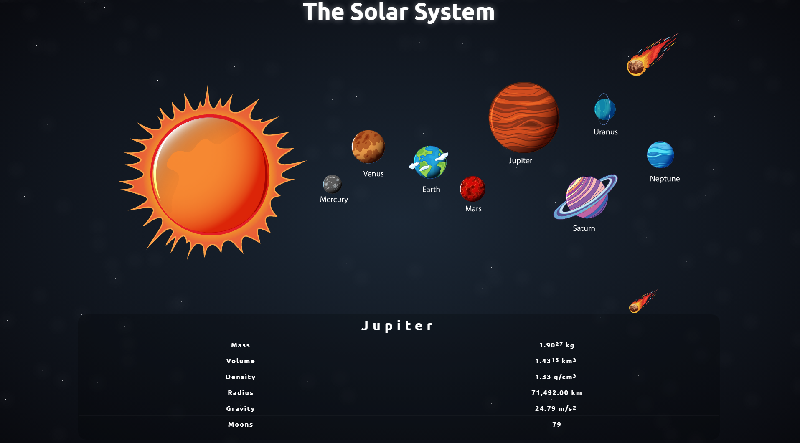

# The-Solar-System

This is a (desktop only) project about our solar system. You can check out some information about our neighbouring planets when clicking on them.

Technologies used:

1. HTML
2. CSS
3. VANILLA JAVASCRIPT

Async/await method was used to retrieve data from a public api [The Solar System OpenData](https://api.le-systeme-solaire.net/en/).

I also used event listeners, regex functions, dom manipulation, css animations and hover events.

[View Project](https://philiphinch.github.io/solar-system/)

---

---
[View Project](https://philiphinch.github.io/solar-system/)

